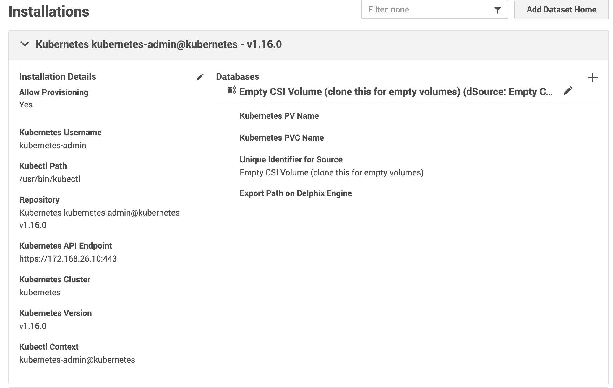
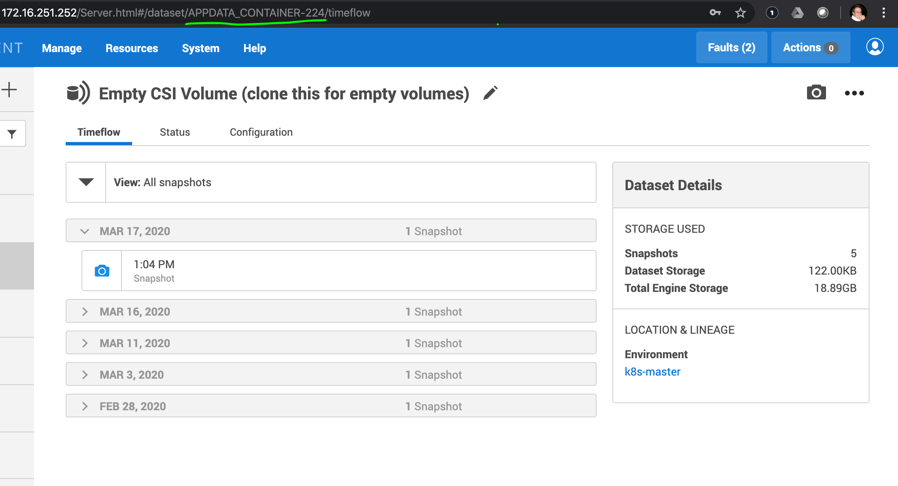

# Delphix CSI driver

Please check the [Design Proposal](./DESIGN.md)
 
## Kubernetes

### Clone this repo into your GOPATH

```
cd $GOPATH
mkdir -p gitlab.delphix.com/daniel.stolf/
cd gitlab.delphix.com/daniel.stolf/
git clone https://gitlab.delphix.com/daniel.stolf/delphix-csi-driver
```

### Requirements

Build a local multi-node Kubernetes cluster on VMWare

```
cd hack && vagrant up
```

Beware that the nodes will have IP addresses 172.168.0.10, 11, 12 etc.

K8S has a pod network with CIDR IP range in 192.168.0.0/24. 

If there's a need to change this ranges, please get in contact at the #delphix-csi Slack channel

This will build a cluster running the latest version of Kubernetes, with all the needed feature gates and pre-reqs needed to run a CSI Driver.

### Deploy K8S Delphix Pluin
Deploy the K8S Python Plugin to the Engine.
```
cd plugin
dvp build && dvp upload -e 172.168.26.9 -u admin --password delphix
```

### Add k8s-master Environment to Delphix
Add k8s-master (172.168.0.10) as an environment on Delphix and provision an empty vFile like any other Linux target.

The follwing NFS Addresses are configure to this Environment:
```
172.168.26.10, 172.16.251.174, 172.168.26.12, 172.17.0.1, 192.168.247.0, 172.16.251.173, 172.168.26.11, 172.17.0.1, 192.168.84.128
```

This list is proved to work, but it might cover more addresses than necessary. 

It is NOT necessary that for environment to be a Kubernetes Cluster Node, we're doing this for the sake of simplicty. It could be a `bastion` node with access to the cluster, `kubectl` binary and `kubeconfig` set.

The plugin will scan for `kubectl` and configured clusters in `$KUBECONFIG` environment variable (default to `~/.kube/config`)

A Kubernetes Repository and a new source should be visible. Add this source:


This is an empty source, with nothing inside. We'll clone this to provision new empty volumes to Kubernetes.

Take note of this empty source reference, we're using that later!


### Deploy

The Manifests in the [deploy folder](./deploy) have not been fully tested yet.

Create a Kubernetes Secret with Delphix credential
```
kubectl create secret generic delphix-creds --from-literal=username=admin --from-literal=password=delphix -n kube-system
```

Edit `deploy/kubernetes/releases/delphix-config.yaml` and apply the appropriate configs (Engine URL, group name the volumes should be created in, repository name, source reference we've saved earlier etc).

Create the config map
```
kubectl apply -f deploy/delphix-config.yaml

```

Deploy the Driver to Kubernetes. The `VolumeSnapshotClass` will throw an error at first, but that's because it should be created after the `controllerserver` is already running
```
kubectl apply -f deploy/kubernetes/releases/csi-delphix-v0.0.2.yaml
```

Check that `de-controller` and `de-node` pods are running. There should be 1 `controller` with a stable name (because it's a `StatefulSet`) and as many `node` pods as there are Kubernetes worker nodes (because it's a `DaemonSet`).
```
$ kubectl get pods -n kube-system
NAME                                      READY   STATUS    RESTARTS   AGE
...
csi-de-controller-0                       4/4     Running   0          91s
csi-de-node-m4l7g                         2/2     Running   0          91s
csi-de-node-vtqpx                         2/2     Running   0          91s
...
```

Create a Delphix Volume in Kubernetes:
```
kubectl apply -f examples/kubernetes/pvc.yaml
```

Create a Snapshot:
```
kubectl apply -f examples/kubernetes/snapshot.yaml
```

Restore snapshot (not working properly yet):
```
kubectl apply -f examples/kubernetes/restore.yaml
```

### Example application - Use Helm to provision a MySQL instance backed by Delphix Volumes:

Install [Helm](https://helm.sh/docs/using_helm)

Deploy MySQL Chart with Helm:

```
examples/kubernetes/mysql
helm install --name my-release -f values.yaml ./
```

## Next Steps

- [ ] Driver should create a Delphix Environment on its own
- [ ] Driver should get empty volume reference on its own
- [ ] An operator pod should dinamically update NFS Addresses when new nodes are added or removed
- [ ] Sample Delphix SDK plugin showcasing database migrations to Kubernetes

## End Goals
- [ ] Feature full driver, with shareable volumes
- [ ] Leverage Kubernetes Operators to expand our supported platforms
- [ ] Migrate standard databases to Kubernetes?
- [ ] What else...?

## Build

Just
```
export GOPRIVATE=gitlab.delphix.com
make
```

## Testing the driver locally

Make sure you've added your Linux environment to Delphix!

### Get the CSC tool

Get the Container Storage Client, which will emulate the gRPC calls to the driver
```
go get github.com/rexray/gocsi/csc
```

### Run the driver in a session
```
sudo bin/delphixplugin --endpoint tcp://127.0.0.1:10000 --url http://172.168.26.9 --username admin --password delphix --envName k8s-master --sourceRef APPDATA_CONTAINER-224 --groupName K8S-Volumes --repositoryName "Kubernetes kubernetes-admin@kubernetes - v1.16.0" --mountPath "/mnt/provision" --nodeid CSINode -v=5
```

### Get plugin info
On another session
```
csc identity plugin-info --endpoint tcp://127.0.0.1:10000
"defs.csi.delphix.com"	"596cd4bba146149eb69a65b997806607aea793bc"
```
### Create a Delphix Volume
```
ret=$(csc controller new --endpoint tcp://127.0.0.1:10000 --cap MULTI_NODE_MULTI_WRITER,mount,nfs --req-bytes 10241024 CSIVolumeName)
ret=$(echo $ret | awk '{print $1 " " $5 " " $8}')
volID=$(echo $ret | awk '{print $1}' | cut -d\" -f2)
sharedPath=$(echo $ret | awk '{print $2}' | cut -d= -f2 | cut -d\" -f2)
volReference=$(echo $ret | awk '{print $3}' | cut -d= -f2 | cut -d\" -f2)
```

This will save the `volID`, `volReference` and `sharedPath` environment variables, which we will use to provide the context to `NodePublish` (in a cluster, Kubernetes and the CSI SideCars would do that)

### Publish (mount) a volume:
```
csc node publish --endpoint tcp://127.0.0.1:10000 --cap MULTI_NODE_MULTI_WRITER,mount,nfs \
--target-path /csi-data-dir/$volID \
--vol-context VolDelphixSharedPath=$sharedPath \
--vol-context VolID=$volID \
--vol-context VolDelphixReference=$volReference \
$volID
```

Check that mount was successful
```
ls -larthd /csi-data-dir/$volID
df -kh /csi-data-dir/$volID
```

### Take a snapshot

```
csc controller snap --endpoint tcp://127.0.0.1:10000 --source-volume $volID snap1
```

### Clone from snapshot

```
kubectl apply -f examples/kubernetes/restore_from_snapshot.yaml
```

### Clone from Volume

Clone from volume isn't working yet. The problem with cloning from snapshot was related to the manifest, not the driver code. This is probably the case again.

### Unpublish (umount) Volume

```
csc node unpublish --endpoint tcp://127.0.0.1:10000 \
--target-path /csi-data-dir/$volID \
$volID
```

Check that volume was umounted:
```
ls -larthd /csi-data-dir/$volID
df -kh /csi-data-dir/$volID
```

## Delete Volume
```
csc controller del --endpoint tcp://127.0.0.1:10000 $volID
```

### Clone from Source or Snapshot

TBD! It's implemented, but `csc` still doesn't support this.

### Rollback

Not in the CSI Spec, so out of scope of this project for now.

## Running Kubernetes End To End tests on Delphix Driver

TBD
